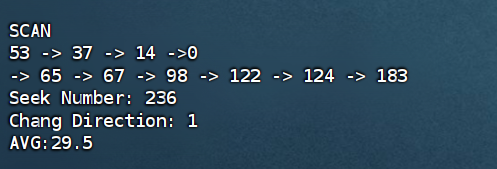
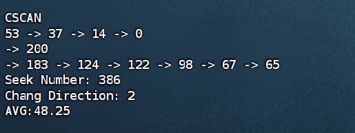
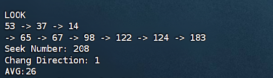

# 实验六 磁盘移臂调度算法实验
## 1.实验目的
    加深对于操作系统设备管理技术的了解，体验磁盘调度算法的重要性
    掌握几种重要的磁盘调度算法，练习模拟算法的编程技巧，锻炼研究分析实验数据的能力

## 2. 实验补充代码

### (1)电梯调度算法

    // 电梯调度算法
    void DiskArm::Scan(void) {
        int Current = CurrentCylinder;
        int Direction = SeekDirection;
        InitSpace("SCAN");
        int point = 0;
        for (int i = 0; i < RequestNumber; i++) {
            if (Cylinder[i] <= Current)
                point++;
        }  // 标记
        sort(Cylinder, RequestNumber);  // 升序排列
        cout << Current << " ";

        if (Direction == 0) {
            for (int i = point - 1; i >= 0; i--) {
                cout << "-> " << Cylinder[i] << " ";
            }
            cout << "->" << 0;
            SeekChang++;
            SeekNumber += abs(Current - 0);
            cout << endl;
            for (int i = point; i < RequestNumber; i++) {
                cout << "-> " << Cylinder[i] << " ";
            }
            SeekNumber += abs(Cylinder[RequestNumber - 1] - 0);
        }

        else if (Direction == 1) {
            for (int i = point; i < RequestNumber; i++) {
                cout << "-> " << Cylinder[i] << " ";
            }
            cout << "-> " << 200;
            SeekNumber += abs(200 - Current);
            SeekChang++;
            cout << endl;
            for (int i = point - 1; i >= 0; i--) {
                cout << "-> " << Cylinder[i] << " ";
            }
            SeekNumber += abs(200 - Cylinder[0]);
        }
        Report();
    }

### (2) CSCAN算法

    // 均匀电梯调度算法
    void DiskArm::CScan(void) {
        int Current = CurrentCylinder;
        int Direction = SeekDirection;
        InitSpace("CSCAN");
        int point = 0;
        for (int i = 0; i < RequestNumber; i++) {
            if (Cylinder[i] <= Current)
                point++;
        }
        sort(Cylinder, RequestNumber);  // 升序排列
        cout << Current << " ";

        if (Direction == 0) {
            for (int i = point - 1; i >= 0; i--) {
                cout << "-> " << Cylinder[i] << " ";
            }
            cout << "-> " << 0;  // 向左到0
            cout << endl;
            cout << "-> " << 200;
            SeekChang++;
            SeekNumber += abs(Current - 0);  // 向左移动到0的距离
            SeekNumber += 200;               // 从0到200
            cout << endl;
            SeekChang++;
            for (int i = RequestNumber - 1; i >= point; i--) {
                cout << "-> " << Cylinder[i] << " ";
            }
            SeekNumber +=
                abs(200 - Cylinder[point + 1]);  // 200到最后一个访问点的距离
        }

        else if (Direction == 1) {
            for (int i = point; i < RequestNumber; i++) {
                cout << "-> " << Cylinder[i] << " ";
            }
            cout << "-> " << 200;
            cout << endl;
            cout << "-> " << 0;
            SeekNumber += abs(200 - Current) + 200;
            SeekChang++;
            cout << endl;
            SeekChang++;
            for (int i = 0; i <= point - 1; i++) {
                cout << "-> " << Cylinder[i] << " ";
            }
            SeekNumber += abs(Cylinder[point - 1] - 0);
        }
        Report();
    }

### (3) LOOK调度

    // LOOK 调度算法
    void DiskArm::Look(void) {
        int Current = CurrentCylinder;
        int Direction = SeekDirection;
        InitSpace("LOOK");
        int point = 0;
        for (int i = 0; i < RequestNumber; i++) {
            if (Cylinder[i] <= Current)
                point++;
        }
        sort(Cylinder, RequestNumber);  // 升序排列
        cout << Current << " ";

        if (Direction == 0) {
            for (int i = point - 1; i >= 0; i--) {
                cout << "-> " << Cylinder[i] << " ";
            }
            SeekChang++;
            SeekNumber += abs(Current - Cylinder[0]);
            cout << endl;
            for (int i = point; i < RequestNumber; i++) {
                cout << "-> " << Cylinder[i] << " ";
            }
            SeekNumber += abs(Cylinder[RequestNumber - 1] - Cylinder[0]);
        }

        else if (Direction == 1) {
            for (int i = point; i < RequestNumber; i++) {
                cout << "-> " << Cylinder[i] << " ";
            }
            SeekNumber += abs(Cylinder[RequestNumber - 1] - Current);
            SeekChang++;
            cout << endl;
            for (int i = point - 1; i >= 0; i--) {
                cout << "-> " << Cylinder[i] << " ";
            }
            SeekNumber += abs(Cylinder[RequestNumber - 1] - Cylinder[0]);
        }
        Report();
    }

## 3.生成结果

[root@localhost oslab6]# ./dask
Please input Current cylinder :53
Please input Current Direction (0/1) :0
Please input Request Numbers :8
Please input Request cylinder string :98 183 37 122 14 124  65 67

FCFS
53
53 -> 98 -> 183
183 -> 37
37 -> 122
122 -> 14
14 -> 124
124 -> 65
65 -> 67
Seek Number: 640
Chang Direction: 7
AVG:80

SSTF
53
53 -> 65 -> 67
67 -> 37 -> 14
14 -> 98 -> 122 -> 124 -> 183
Seek Number: 236
Chang Direction: 3
AVG:29.5

SCAN
53 -> 37 -> 14 ->0
-> 65 -> 67 -> 98 -> 122 -> 124 -> 183 
Seek Number: 236
Chang Direction: 1
AVG:29.5

CSCAN
53 -> 37 -> 14 -> 0
-> 200
-> 183 -> 124 -> 122 -> 98 -> 67 -> 65 
Seek Number: 386
Chang Direction: 2
AVG:48.25

LOOK
53 -> 37 -> 14 
-> 65 -> 67 -> 98 -> 122 -> 124 -> 183 
Seek Number: 208
Chang Direction: 1
AVG:26

## 4.算法说明

### Scan 算法

函数开始时，首先获取当前磁道`Current`和寻找方向`Direction`。然后，初始化一个名为`SCAN`的空闲磁道。接下来，遍历请求磁道数组`Cylinder`，计算请求磁道数组中不大于当前磁道的请求数量`point`

接下来对请求磁道数组进行升序排列。然后，根据当前磁道和寻找方向，分别计算电梯的移动路径。如果寻找方向为0，即从当前磁道向左移动，则从`point-1`开始遍历请求磁道数组，直到遍历完整个数组。在遍历过程中，输出电梯的移动路径

最后计算电梯移动的总距离`SeekNumber`，并输出结果

### C-Scan 算法

遍历磁道请求队列，统计磁道号小于等于当前磁道号的请求数量

然后对磁道请求队列进行升序排列，如果磁头移动方向为0（向左），则从当前磁道开始，依次访问磁道号最小的请求，直到访问完所有请求。在访问过程中，磁头始终朝左移动，当到达磁盘的左边界时，再改变方向继续访问；如果磁头移动方向为1（向右），则从当前磁道开始，依次访问磁道号最大的请求，直到访问完所有请求。在访问过程中，磁头始终朝右移动，当到达磁盘的右边界时，再改变方向继续访问

最后调用 `Report` 函数输出磁盘访问顺序和磁头移动距离

### Look 算法

遍历请求队列，统计当前磁道号小于等于当前磁盘指针 CurrentCylinder 的请求数量 point

之后对请求队列进行升序排列，如果当前磁盘指针 CurrentCylinder 与请求队列中的第一个请求的磁道号相等，则直接输出当前磁盘指针 CurrentCylinder，并更新磁盘访问距离 SeekNumber

如果当前磁盘指针 CurrentCylinder 与请求队列中的最后一个请求的磁道号相等，则先输出当前磁盘指针 CurrentCylinder，再输出请求队列中的所有请求，并更新磁盘访问距离 SeekNumber；如果当前磁盘指针 CurrentCylinder 与请求队列中的其他请求的磁道号不相等，则根据当前磁盘指针 CurrentCylinder 与请求队列中的第一个请求的磁道号之间的距离，选择一个最优的访问顺序，并输出访问顺序，同时更新磁盘访问距离 SeekNumber 和磁盘访问次数SeekChang

最后输出磁盘访问距离SeekNumber和磁盘访问次数SeekChang