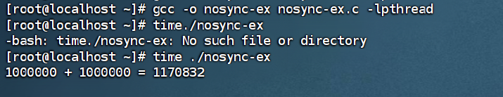
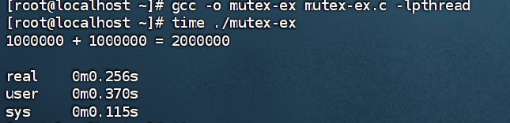
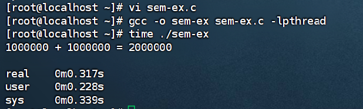
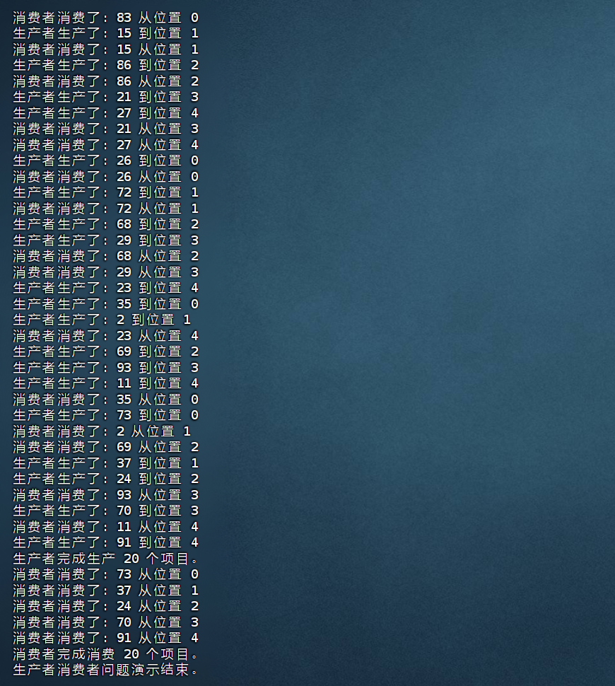

# 实验二 作业
## 任务一 完成示例代码的编译
### nosync-ex的编译与执行

    #include <stdio.h>
    #include <pthread.h>

    int sum = 0;

    void *thread() {
        int i;
        for (i = 0; i < 1000000; i++) {
            ++sum;
        }
        return NULL;
    }

    int main() {
        pthread_t tid1, tid2;
        pthread_create(&tid1, NULL, thread, NULL);
        pthread_create(&tid2, NULL, thread, NULL);
        pthread_join(tid1, NULL);
        pthread_join(tid2, NULL);
        printf("1000000 + 1000000 = %d\n", sum);
        return 0;
    }

输入 
    
    gcc -o nosync-ex nosync-ex.c -lpthread
    time ./nosync-ex
得到如下结果：

这个例子展示了在没有同步机制的情况下，多个线程同时修改同一个共享变量（sum）时可能发生的竞态条件。由于线程执行的交错，最终结果往往不是预期的 2000000，从而说明了同步的必要性。

### mutex-ex的编译与执行

    #include <stdio.h>
    #include <pthread.h>

    int sum = 0;
    pthread_mutex_t mutex;

    void *thread() {
        int i;
        for (i = 0; i < 1000000; i++) {
            pthread_mutex_lock(&mutex);
            ++sum;
            pthread_mutex_unlock(&mutex);
        }
        return NULL;
    }
    int main() {
        pthread_t tid1, tid2;
        pthread_mutex_init(&mutex, NULL);

        pthread_create(&tid1, NULL, thread, NULL);
        pthread_create(&tid2, NULL, thread, NULL);
        pthread_join(tid1, NULL);
        pthread_join(tid2, NULL);
        printf("1000000 + 1000000 = %d\n", sum);
        return 0;
    }

编译运行得到：

这个例子使用了互斥锁（pthread_mutex_t）来保护对共享变量 sum 的访问。在每次修改 sum 之前，线程都会获取互斥锁；修改完成后，释放互斥锁。这样确保了在任何时候只有一个线程能够访问和修改 sum，从而避免了竞态条件，得到正确的结果 2000000。

### sem-ex的编译与执行

    #include <stdio.h>
    #include <pthread.h>
    #include <semaphore.h>

    int sum = 0;
    sem_t sem;

    void *thread() {
        int i;
        for (i = 0; i < 1000000; i++) {
            sem_wait(&sem);
            ++sum;
            sem_post(&sem);
        }
        return NULL;
    }
    int main() {
        pthread_t tid1, tid2;
        sem_init(&sem, 0, 1);

        pthread_create(&tid1, NULL, thread, NULL);
        pthread_create(&tid2, NULL, thread, NULL);
        pthread_join(tid1, NULL);
        pthread_join(tid2, NULL);
        printf("1000000 + 1000000 = %d\n", sum);
        return 0;
    }

编译运行：

这个例子使用了信号量（sem_t）来实现线程同步。在这里，信号量被用作一个二元信号量（初始值为 1），起到了类似互斥锁的作用，保证了对 sum 的互斥访问。
## 任务二 生产者与消费者问题

代码如下：

    #include <pthread.h>   // 包含pthread库头文件，用于线程函数
    #include <stdio.h>     // 包含标准输入输出库头文件
    #include <stdlib.h>    // 包含标准库头文件，用于rand(), exit()
    #include <unistd.h>    // 包含POSIX操作系统API头文件，用于usleep()
    #include <semaphore.h> // 包含semaphore库头文件，用于信号量函数

    #define BUFFER_SIZE 5 // 定义共享缓冲区的大小
    #define MAX_ITEMS 20  // 定义生产/消费的总项目数

    // 共享缓冲区
    int buffer[BUFFER_SIZE];
    int in = 0;  // 生产者写入位置索引
    int out = 0; // 消费者读取位置索引

    // 同步原语
    pthread_mutex_t mutex; // 互斥锁，用于保护缓冲区的访问
    sem_t empty;         // 信号量，用于计数空槽位 (生产者等待此信号量)
    sem_t full;          // 信号量，用于计数已填充槽位 (消费者等待此信号量)

    int produced_count = 0; // 已生产的项目计数器
    int consumed_count = 0; // 已消费的项目计数器

    // 生产者线程函数
    void *producer(void *param) {
        int item; // 待生产的项目

        while (produced_count < MAX_ITEMS) {
            item = rand() % 100; // 生产一个随机项目

            // 等待一个空槽 (递减empty信号量)
            // 如果empty信号量为0，生产者将在此阻塞
            sem_wait(&empty);

            // 获取互斥锁，进入临界区访问缓冲区
            pthread_mutex_lock(&mutex);

            // 将项目添加到缓冲区
            buffer[in] = item;
            printf("生产者生产了: %d 到位置 %d\n", item, in);
            in = (in + 1) % BUFFER_SIZE; // 移动到下一个位置 (循环缓冲区)
            produced_count++; // 增加已生产计数

    "pv1.c" 131L, 4351B
            printf("消费者消费了: %d 从位置 %d\n", item, out);
            usleep(rand() % 800000); // 暂停0到0.8秒
        }

        printf("消费者完成消费 %d 个项目。\n", MAX_ITEMS);
        pthread_exit(0); // 线程退出
    }

    int main() {
        pthread_t tid_producer; // 生产者线程ID
        pthread_t tid_consumer; // 消费者线程ID

        // 初始化互斥锁
        pthread_mutex_init(&mutex, NULL);

        // 初始化信号量
        // sem_init(&sem, pshared, value)
        // pshared = 0 表示信号量在线程间共享
        // empty 信号量初始值为 BUFFER_SIZE (所有槽位最初都是空的)
        sem_init(&empty, 0, BUFFER_SIZE);
        // full 信号量初始值为 0 (最初没有已填充的槽位)
        sem_init(&full, 0, 0);

        // 创建生产者线程
        if (pthread_create(&tid_producer, NULL, producer, NULL) != 0) {
            perror("创建生产者线程失败");
            return 1;
        }

        // 创建消费者线程
        if (pthread_create(&tid_consumer, NULL, consumer, NULL) != 0) {
            perror("创建消费者线程失败");
            return 1;
        }

        // 等待两个线程完成
        pthread_join(tid_producer, NULL);
        pthread_join(tid_consumer, NULL);

        // 销毁同步原语
        pthread_mutex_destroy(&mutex);
        sem_destroy(&empty);
        sem_destroy(&full);
    }

得到如下结果：

这一部分提供了一个经典的生产者与消费者问题的解决方案，使用了互斥锁和信号量来实现线程间的协作和同步。

 共享缓冲区 (buffer): 生产者将产品放入其中，消费者从中取出产品。缓冲区大小固定为 BUFFER_SIZE（此处为 5）。

 索引 (in 和 out): in 指向生产者下一个可以放入产品的位置，out 指向消费者下一个可以取出产品的位置。

 互斥锁 (mutex): 用于保证对共享缓冲区 buffer、in 和 out 的互斥访问，避免多个线程同时修改这些共享资源。

信号量 (empty 和 full):
 empty 信号量：表示缓冲区中空槽位的数量，初始值为 BUFFER_SIZE。生产者在放入产品前会等待 empty 信号量，确保缓冲区有空位；放入后会增加 full 信号量。

 full 信号量：表示缓冲区中已填充槽位的数量，初始值为 0。消费者在取出产品前会等待 full 信号量，确保缓冲区有产品；取出后会增加 empty 信号量。
 
 生产者线程 (producer): 负责生成产品并放入缓冲区。在放入前，需要等待 empty 信号量和获取 mutex。

 消费者线程 (consumer): 负责从缓冲区取出产品并进行消费。在取出前，需要等待 full 信号量和获取 mutex。